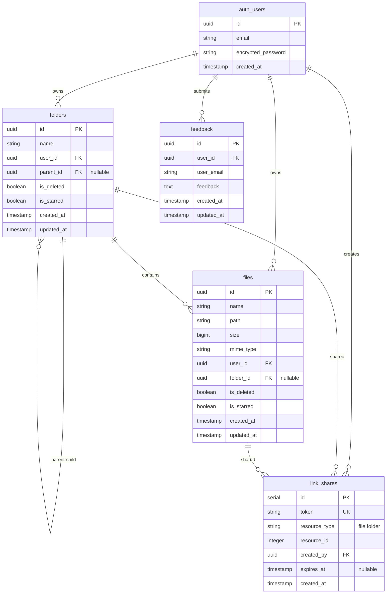

# ☁️ Cloud Drive - Personal Cloud Storage System

A full-stack cloud storage application built with React and Node.js, providing secure file management, folder organization, sharing capabilities, and more.


## 🌐 Live Demo

- **Frontend (Netlify)**: [https://cloud-drive-aahil.netlify.app](https://cloud-drive-aahil.netlify.app)
- **Backend API (Render)**: [https://cloud-drive-final-backend.onrender.com](https://cloud-drive-final-backend.onrender.com)
- **GitHub Repository**: [https://github.com/AahilGazali/Cloud-Drive-Final](https://github.com/AahilGazali/Cloud-Drive-Final)

## 📋 Table of Contents

- [Features](#-features)
- [Tech Stack](#-tech-stack)
- [Database Schema (ER Diagram)](#-database-schema-er-diagram)
- [Project Structure](#-project-structure)
- [Getting Started](#-getting-started)
- [Environment Variables](#-environment-variables)
- [API Documentation](#-api-documentation)
- [Deployment](#-deployment)
- [Troubleshooting](#-troubleshooting)
- [Contributing](#-contributing)

## ✨ Features

### Core Features
- 📁 **File Management**: Upload, download, rename, move, and delete files
- 📂 **Folder Organization**: Create nested folders with hierarchical structure
- 🔍 **Search**: Full-text search across files and folders
- ⭐ **Starred Items**: Mark important files and folders for quick access
- 🗑️ **Trash System**: Soft delete with recovery capability
- 🔗 **File Sharing**: Generate shareable links for files and folders
- 📧 **Email Sharing**: Share files via email with secure links
- 👤 **User Authentication**: Secure JWT-based authentication
- 🌐 **Multi-language Support**: Internationalization ready
- 🎨 **Theme Support**: Light and dark mode
- 📱 **Responsive Design**: Works on desktop, tablet, and mobile

### Advanced Features
- 📊 **Storage Management**: Track storage usage and limits
- 🔐 **Row-Level Security**: Database-level security with Supabase RLS
- ⚡ **Optimized Performance**: Efficient queries with proper indexing
- 🔄 **Real-time Updates**: Instant UI updates after operations
- 📝 **Feedback System**: User feedback collection and management

## 🛠️ Tech Stack

### Frontend
- **React 18.2.0** - UI framework
- **React Router 6.20.0** - Client-side routing
- **Tailwind CSS** - Utility-first CSS framework
- **Axios** - HTTP client

### Backend
- **Node.js** - Runtime environment
- **Express.js** - Web framework
- **PostgreSQL** - Database (via Supabase)
- **Supabase** - Backend-as-a-Service (Database, Storage, Auth)
- **JWT** - Authentication tokens
- **Multer** - File upload handling
- **Nodemailer** - Email service

### Infrastructure
- **Supabase** - Database and file storage
- **Netlify** - Frontend hosting
- **Railway/Vercel** - Backend hosting (optional)

## 🗄️ Database Schema (ER Diagram)



### Table Descriptions

#### `folders`
Stores folder information with hierarchical structure.
- **id**: Unique identifier (UUID)
- **name**: Folder name (VARCHAR 255)
- **user_id**: Owner's user ID (references auth.users)
- **parent_id**: Parent folder ID for nesting (nullable, self-referencing)
- **is_deleted**: Soft delete flag
- **is_starred**: Starred status
- **created_at**: Creation timestamp
- **updated_at**: Last update timestamp

#### `files`
Stores file metadata. Actual files are stored in Supabase Storage.
- **id**: Unique identifier (UUID)
- **name**: Original filename
- **path**: Storage path in Supabase Storage
- **size**: File size in bytes
- **mime_type**: MIME type (e.g., "application/pdf")
- **user_id**: Owner's user ID
- **folder_id**: Parent folder ID (nullable for root files)
- **is_deleted**: Soft delete flag
- **is_starred**: Starred status
- **created_at**: Creation timestamp
- **updated_at**: Last update timestamp

#### `link_shares`
Manages shareable links for files and folders.
- **id**: Auto-incrementing ID
- **token**: Unique share token
- **resource_type**: Type of resource ("file" or "folder")
- **resource_id**: ID of the shared resource
- **created_by**: User who created the share
- **expires_at**: Optional expiration timestamp
- **created_at**: Creation timestamp

#### `feedback`
Stores user feedback submissions.
- **id**: Unique identifier (UUID)
- **user_id**: User who submitted feedback
- **user_email**: User's email address
- **feedback**: Feedback text content
- **created_at**: Submission timestamp
- **updated_at**: Last update timestamp

### Relationships
- **One-to-Many**: Users → Folders, Users → Files, Users → Link Shares, Users → Feedback
- **Self-Referencing**: Folders → Folders (parent-child hierarchy)
- **One-to-Many**: Folders → Files (folder contains files)

## 📁 Project Structure

```
G-Drive/
├── Frontend/                 # React frontend application
│   ├── public/              # Static assets
│   ├── src/
│   │   ├── components/      # React components
│   │   │   ├── FileExplorer/
│   │   │   ├── FileItem/
│   │   │   ├── FolderItem/
│   │   │   ├── Sidebar/
│   │   │   └── ...
│   │   ├── pages/           # Page components
│   │   │   ├── Dashboard/
│   │   │   ├── Login/
│   │   │   ├── Signup/
│   │   │   └── ...
│   │   ├── services/       # API service layer
│   │   ├── hooks/          # Custom React hooks
│   │   ├── context/        # React context providers
│   │   └── utils/          # Utility functions
│   ├── package.json
│   └── .gitignore
│
├── Backend/                 # Node.js backend application
│   ├── src/
│   │   ├── modules/        # Feature modules
│   │   │   ├── auth/       # Authentication
│   │   │   ├── files/      # File operations
│   │   │   ├── folders/    # Folder operations
│   │   │   ├── shares/     # Sharing functionality
│   │   │   ├── trash/      # Trash management
│   │   │   ├── search/     # Search functionality
│   │   │   └── feedback/   # Feedback system
│   │   ├── config/         # Configuration files
│   │   ├── middlewares/    # Express middlewares
│   │   ├── utils/          # Utility functions
│   │   └── server.js      # Entry point
│   ├── migrations/         # Database migrations
│   ├── scripts/            # Utility scripts
│   ├── package.json
│   └── .env.example
│
├── README.md               # This file
├── netlify.toml            # Netlify configuration
├── vercel.json             # Vercel configuration
└── railway.json            # Railway configuration
```

## 🚀 Getting Started

### Prerequisites

- Node.js >= 18.0.0
- npm >= 9.0.0
- Supabase account
- Git

### Installation

1. **Clone the repository**
   ```bash
   git clone https://github.com/yourusername/Cloud-Drive-Final.git
   cd Cloud-Drive-Final
   ```

2. **Set up Supabase**
   - Create a new project at [supabase.com](https://supabase.com)
   - Run the migration files in `Backend/migrations/` in order
   - Set up a storage bucket named "files"
   - Configure Row-Level Security policies (see `Backend/FIX_RLS_UPLOAD_ERROR.sql`)

3. **Backend Setup**
   ```bash
   cd Backend
   npm install
   cp .env.example .env
   # Edit .env with your Supabase credentials
   npm run dev
   ```

4. **Frontend Setup**
   ```bash
   cd Frontend
   npm install
   # Create .env file with REACT_APP_API_URL
   npm start
   ```

### Database Setup

Run the following migrations in Supabase SQL Editor in order:

1. `001_create_folders_table.sql` - Creates folders table
2. `002_add_is_deleted_columns.sql` - Adds soft delete columns
3. `003_create_link_shares_table.sql` - Creates sharing table
4. `004_add_starred_column.sql` - Adds starred functionality
5. `005_create_feedback_table.sql` - Creates feedback table
6. `FIX_RLS_UPLOAD_ERROR.sql` - Sets up RLS policies

## 🔐 Environment Variables

### Backend (.env)

```env
# Server
NODE_ENV=development
PORT=8080
CLIENT_URL=http://localhost:3000

# JWT
JWT_SECRET=your-secret-key-here
JWT_EXPIRES_IN=7d

# Supabase
SUPABASE_URL=https://your-project.supabase.co
SUPABASE_SERVICE_ROLE_KEY=your-service-role-key
SUPABASE_DB_URL=postgresql://postgres:[password]@[host]:5432/postgres
SUPABASE_BUCKET=files

# Email (Optional - for sharing)
SMTP_HOST=smtp.gmail.com
SMTP_PORT=587
SMTP_USER=your-email@gmail.com
SMTP_PASS=your-app-password
SMTP_SECURE=false
FROM_EMAIL=your-email@gmail.com
FROM_NAME=Cloud Drive
```

### Frontend (.env)

```env
REACT_APP_API_URL=http://localhost:8080/api
```

## 📚 API Documentation

### Authentication

#### Register
```http
POST /api/auth/register
Content-Type: application/json

{
  "email": "user@example.com",
  "password": "password123"
}
```

#### Login
```http
POST /api/auth/login
Content-Type: application/json

{
  "email": "user@example.com",
  "password": "password123"
}
```

### Files

#### Upload File
```http
POST /api/files
Authorization: Bearer <token>
Content-Type: multipart/form-data

file: <file>
folderId: <uuid> (optional)
```

#### List Files
```http
GET /api/files?folderId=<uuid>
Authorization: Bearer <token>
```

#### Download File
```http
GET /api/files/:id/signed-url
Authorization: Bearer <token>
```

#### Delete File
```http
DELETE /api/files/:id
Authorization: Bearer <token>
```

#### Rename File
```http
PATCH /api/files/:id/rename
Authorization: Bearer <token>
Content-Type: application/json

{
  "name": "new-name.pdf"
}
```

### Folders

#### Create Folder
```http
POST /api/folders
Authorization: Bearer <token>
Content-Type: application/json

{
  "name": "New Folder",
  "parentId": "<uuid>" (optional)
}
```

#### List Folders
```http
GET /api/folders?parentId=<uuid>
Authorization: Bearer <token>
```

#### Delete Folder
```http
DELETE /api/folders/:id
Authorization: Bearer <token>
```

### Search

```http
GET /api/search?q=search-term
Authorization: Bearer <token>
```

### Trash

#### Get Trash Items
```http
GET /api/trash
Authorization: Bearer <token>
```

#### Restore Item
```http
POST /api/trash/:id/restore
Authorization: Bearer <token>
```

#### Permanently Delete
```http
DELETE /api/trash/:id
Authorization: Bearer <token>
```

## 🚢 Deployment

### Frontend (Netlify)

**Live URL**: [https://cloud-drive-aahil.netlify.app](https://cloud-drive-aahil.netlify.app)

1. Connect your GitHub repository to Netlify
2. Set build settings:
   - **Base directory**: `Frontend`
   - **Build command**: `npm install --legacy-peer-deps && npm run build`
   - **Publish directory**: `Frontend/build`
3. Add environment variable: `REACT_APP_API_URL`
4. Deploy!

### Backend (Render)

**Live URL**: [https://cloud-drive-final-backend.onrender.com](https://cloud-drive-final-backend.onrender.com)

#### Render
1. Create a new Render account
2. Connect your GitHub repository
3. Set root directory to `Backend`
4. Add all environment variables from `.env`
5. Deploy!

#### Railway (Alternative)
1. Create a new Railway project
2. Connect your GitHub repository
3. Set root directory to `Backend`
4. Add all environment variables from `.env`
5. Deploy!

#### Vercel
1. Import your GitHub repository
2. Set root directory to `Backend`
3. Add environment variables
4. Deploy!

## 🐛 Troubleshooting

### Common Issues

#### "Permission denied" error on file upload
- **Solution**: Run `Backend/FIX_RLS_UPLOAD_ERROR.sql` in Supabase SQL Editor
- See `QUICK_FIX_UPLOAD_ERROR.md` for detailed instructions

#### Database connection errors
- **Solution**: Use Session Pooler connection string instead of Direct connection
- See `Backend/DATABASE_SETUP.md` for details

#### Missing columns error
- **Solution**: Run all migration files in order
- Check `Backend/migrations/` directory

#### Build errors on Netlify
- **Solution**: Ensure `node_modules` is not committed to git
- Check `netlify.toml` configuration

## 🤝 Contributing

Contributions are welcome! Please follow these steps:

1. Fork the repository
2. Create a feature branch (`git checkout -b feature/amazing-feature`)
3. Commit your changes (`git commit -m 'Add some amazing feature'`)
4. Push to the branch (`git push origin feature/amazing-feature`)
5. Open a Pull Request

## 📄 License

This project is licensed under the MIT License.

## 👨‍💻 Author

**Aahil Gazali**
- GitHub: [@AahilGazali](https://github.com/AahilGazali)

## 🙏 Acknowledgments

- Supabase for providing excellent backend infrastructure
- React team for the amazing framework
- All contributors and users of this project

---

**Made with ❤️ for secure and efficient cloud storage**
